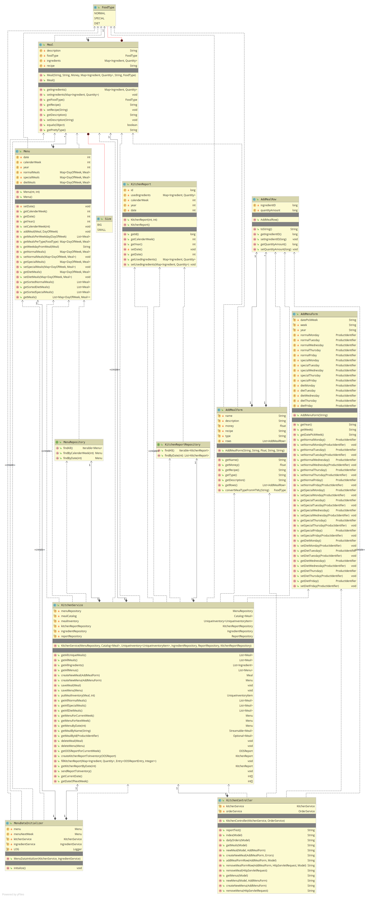
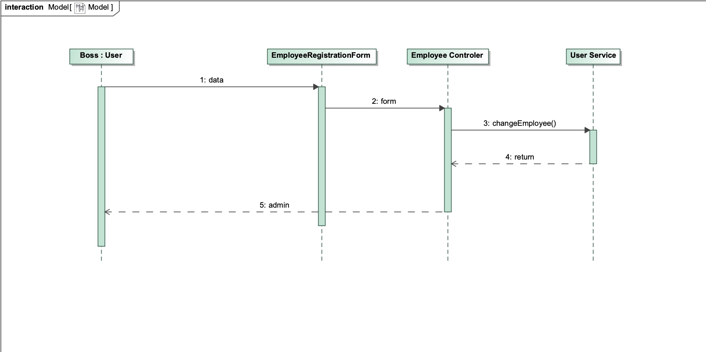

= Entwicklerdokumentation swt19w36 - Best-Food-Catering
:project_name: swt19w36
:toc: macro

[options="header"]
|===
|Version | Status      | Date   | Authors | Note
|0.1    | work-in-progress  | 11.11.2019 | Jonas Bohmann | Struktur vorbereiten & Aufgabenstellung hinzufügen
|1.0    | Published  | 17.11.2019 | David Schneider, Justin Bürger, Ignacio Vazquez, Dominik Hirsch, Jonas Bohmann | 2. Meilenstein
|2.0    | Published  | 19.11.2020 | David Schneider, Justin Bürger, Ignacio Vazquez, Dominik Hirsch, Jonas Bohmann | Projektabgabe
|===

toc::[]

== 0. Aufgabenteilung

[options="header"]
|===
|Name |Developer Documentation Section |Building block view, prototype and test cases (test_plan.adoc)
|Justin | 1 |Inventory, Accounting
|Jonas | 3, 4.2, 5.2, 5.7 |Kitchen
|Ignacio | 6, 5.6 | Management
|David | 2, 4.3 |Authentication, Company Management
|Dominik | 4.1, 5.1 |Online-Ordering-System
|===

== 1. Introduction and Goals

=== 1.1. Task Definition
The Best-Food-Catering GmbH & Co KG is an upcoming company that focuses on the special requirements for the supply of food to day-care centers, schools and corporations.
Due to the increased interest in child care in some states of Germany, there is a need to restructure the companies organization for significant growth and this includes a software-technical solution. In this document we want to give the reader a clear picture of our design. Please note that the actual software might differ from the design shown below. It is our purpose to communicate ideas and possible solutions that is why the content is unlikely to be complete or consistent.
In order to implement the software best, it is necessary to take a closer look at the structure and the requirements of the Best-Food-Catering GmbH & Co KG.

Since the principal purpose is that customers can order their food online, we need an online ordering system providing this feature.
Our customers as well as the employees of our company can see the menu (*_menu_*) where they can order meals for the following week.
After they have chosen their preferred dishes, it is possible for the customer to check his choice in the cart (*_cart_*) and modify his order by deleting unwanted items.
Next up is the payment process where the user can either chose to pay by himself (*_singleBilling_*) or in case he belongs to a kindergarten it is possible for him to pay as a member of this kindergarten (*_groupBilling_*). If the customer decides to use singleBilling, he has the opportunity to pay by debits card (*_debitsCard_*) or by cheque (*_cheque_*).
After finishing the payment process, the customer is able to see his orders (*_myOrders_*). The boss of the company can furthermore see all of the orders which have been made (*_adminOrderView_*) and he is able to confirm orders in case they were issued with the option cheque.

A Customer (*_Customer_*) can register him/herself and attach to an organisation (*_Company_*). Each company can register (*_register_*) and will be available instantly to manage its employees(_*Customers*_), i.e. is able to delete (*_delete()_*) them or to set the longevity for the user-account (*_expireDate_*). Speaking of which, of course also the Best-Food-Catering employees (_*Employees*_) need to work with the software. There are currently four types of employees: kitchen staff (*_KITCHEN_*), accountants (*_ACCOUNTING_*), storekeeper (*_STORAGE_*), additionally, there is an admin (*_Admin_*) and a boss (*_Boss_*).
Our Boss is allowed to do anything each employee (*_Employee_*) can. 

There is also a technical admin, who is responsible for deleting customers (*_deleteCustomer()_*), locking accounts (*_lockAccount()_*), and change the Information about Employees (*_UpdateEmployeeInformation()_*).

Members of the kitchen staff (*_Kitchen_*) can create new meals (*_Meals_*) and set their name, price, description, recipe, type (*_Meal.FoodType_*) and list of ingredients (*_Ingredients_*).
 These meals can then be added to a weekly menu (*_Menu_*), which the kitchen staff can also create for each week by their calender week (*calenderWeek*). Every Saturday night at 00:01, the Online Ordering system
 sends a report (*_OOSReport_*) to the Kitchen with a list of meals that were ordered this week. The cook can then see the orders for each day with the amount of times they were ordered and the size of the order (*_Meal.Size_*),
  big (*_Meal.Size.BIG_*) for Companies and small (*_Meal.Size.SMALL_*) for Kitas and Schools. Based on the report from the Online-Ordering-System, the kitchen automatically sends
  a report (*_KitchenReport_*) to the Storage with a list of ingredients and how often they were used during the last week, allowing the Storekeeper to order new ones.

A ranking of each meal (*_Statistics_*) can be found in the Kitchen dashboard as well (our Kundenwunsch).

The Storagekeeper can check if ingredients need to be reordered – in case that some ingredients are missing they are ordered and created (*_createIngredient()_*). Ingredients which best before date (*_bestBefore_*) has expired will be shown to the Storagekeeper everytime he logs in (*_storageDefault()_*) and he now needs to remove these from his inventory and delete them inside the software (*_deleteExpiredIngredients()_*). Of course the storagekeeper has also a view where he can view all stored ingredients (*_stock_*) and delete them if he wishes to do so (*_deleteIngredient()_*). All ingredients have a price (*_price_*), a quantity(*_quantity_*), a metric(*_metric_*) and a minimal amount (*_minAmount_*); the storagekeeper cannot create ingredients with a quantity less then the minimal amount(*_minAmount()_*).

The accountant is doing most of his work offline because accountants tend to be hostile toward automatization (and understandably so). Of course, we will implement the software according to his preferences. In our software the accountant will have two views, one for the customers and one for companies. He can both activate customers/companies (*_activateCustomer()_*, *_activateCompany()_*) and deactivate them (*_deactivate()_*, *_deactivateCompany()_*).
All in all, we want a nice, intuitive and secure system. Our focus lies on the security and reliability of the internal processes of the Best-Food-Catering-GmbH. Also, we want our customers to have an intuitive GUI, so that it is easy to order with our software, since especially in the social realm people tend to be digital analphabets.

The Boss can manage all the employees from BFC. With the method (*_registerEmployee()_*) he can register a new employee from any service branch in our company. With the method (*_changeEmployee()_*) the boss can edit the personal information of each and every employee. The Boss can also delete employees with the method (*_deleteEmployeeByID_*).

=== 1.2. Quality Demands

To measure the quality of the application, quality demands have to be defined, which have to be fulfilled.
_Note: The following descriptions are derived from the https://iso25000.com/index.php/en/iso-25000-standards/iso-25010[ISO/IEC 25010 Software Quality Model^].

Maintainability::
This characteristic represents the degree of effectiveness and efficiency with which a product or system can be modified to improve it, correct it or adapt it to changes in environment, and in requirements.

Usability::
Degree to which a product or system can be used by specified users to achieve specified goals with effectiveness, efficiency and satisfaction in a specified context of use.

Security::
Degree to which a product or system protects information and data so that persons or other products or systems have the degree of data access appropriate to their types and levels of authorization.

The following table shows what quality demands have to be fulfilled to which extent.
The first column lists the quality demands, while in the following columns an "x" is used to mark the priority.
The assigned priority has to be considered in the formulation of the concrete non-functional requirements.

1 = Not Important ..
5 = Very Important
[options="header", cols="3h, ^1, ^1, ^1, ^1, ^1"]
|===
|Quality Demand           | 1 | 2 | 3 | 4 | 5
|Maintainability          |   |   |   |   |x
|Usability                |   |   |   |   |x
|Security                 |   |   |   |   |x
|Reliability              |   |   |   |   |x
|Coverage                 |   |x  |   |   |
|===

== 2. Constraints

=== 2.1. Hardware Specifications
* Server
* Computer (Client)
* Keyboard (Physical or on display)
* Mouse or Touchscreen

=== 2.2. Software Specifications
*Client:*

* Edge
* Google Chrome 45+
* Opera 30+
* iOS 9+
* Firefox 38+

*Server:*

* Java 8+
* Spring 5+
* Salespoint 7+

=== 2.3. Product Usage

Our system is going to be used as an interface between the customers and our catering company. If a customer is a company it first needs to register itself onto the platform. Any employee of this company can create an account themself but needs to wait until the admin of their company accepts the worker.
After a successful registration the employee can see the menu of the current week as well as order meals for the upcoming week. Besides that there is a page with insight to all previous orders. The software is supposed to run 24/7.

Our customers cannot be expected to have deeper knowledge about IT or web-design. Therefore a user-friendly experience has a special weight. The goal is a self-explaining design. In general the users (Customer) of our web interface are parents, workers as well as administrators (/Boss) of the registered companies.

Any data will be stored persistently in a database and can be accessible by authorized persons (Role) through this website.

== 3. Context and Scope

=== 3.1 Context Diagram
The design-context diagram shows our planned system in its environment.

image::models\design\best-food-catering_design-context.png[Design Context]

== 4. Solution Strategy

=== 4.1 Quality Demand Fulfilment
The following table shows our quality demands as defined in the
“Pflichtenheft” and our approaches to fulfil them.

[options="header"]
|===
|Quality Demand	 |Solution approach
|Functionality/Reliability |

*Testing* - By testing our program extensively during and after development, we will make sure to provide our customers with a reliably working service.

*Development Process* - By working as a team and developing our program from the ground up using an iterative development process - starting with the analysis - we will prevent bugs and ensure the functionality of the application.

*Customer Proximity* - Through weekly meetings with our beloved customer we’re guaranteeing that all his demands and wishes regarding the functionality are being incorporated.

*Margin of Error* - We will handle faulty input from the user and give him easily understandable feedback to avoid this from happening again.

*Security* - We will prevent unauthorized persons from accessing functionalities they’re not supposed to see by using Spring Security and Thymeleaf (sec: authorize) and store data in such a way that it can’t be accessed from an outsider e.g. by storing all the passwords as hashes.

|Usability |

*Understandability* - By using everyday language we will be making sure that people without a computer science background will be able to use our service with ease.

*Visual cues* - By using different colours, arranging similar functionalities closer to each other and different functionalities further apart we will ensure that our webpage is easy to work with.

*Inclusion* - By using inclusive language and appropriately sized text fonts, we will make sure that as many people as possible will be able to use our service.

*Aesthetics* - It is our goal to provide our users with a visually pleasing experience.

|Maintainability/Efficiency |*Code quality* - By using tools such as SonarQube, we will be evaluating and improving our code making it easier to understand and thus easier to maintain.

*Allocation of tasks* - Since every team member has his own ‘area of work’ and develops his part of the program from the ground up, everyone in the team is aware of what’s happening in big chunks of the code which makes our code easier to maintain.

|Portability |By using Java and JVM we will ensure that our application will be portable and can therefore be used by as many people as possible.
|Extendibility |*Modularity* - By arranging our application in a modular way, new changes in one module won’t have a big impact on other modules, making it easier to add functionality to our existing code.
|===

=== 4.2 Software Architecture

Top-Level view of our system.

image::models\design\best-food-catering_design-top-level-architecture.png[Design Context]

Client Server Model of our application. The client only contains HTML, CSS + Bootstrap files.
All application logic is implemented on our server.

image::models\design\best-food-catering_client-server-diagram.png[Client-Server diagram]

=== 4.3 Architecture decisions

==== 4.3.1. Design Patterns

*Used Patterns*

* Spring MVC
* Spring Factory Method (Beans and Interfaces, _here: User_)
* Iterator

==== 4.3.2. Persistence

https://github.com/st-tu-dresden-praktikum/swt19w36-videoshop/blob/master/src/main/asciidoc/developer_documentation.adoc#432-persistence[See Persistence]

==== 4.3.3. User Interface

image::models\design\best-food-catering_ux.png[User interface]

==== 4.3.4. Use of external frameworks

* Spring 5
* Sprint Boot
* Salespoint 7.2.1

== 5. Building block view

=== 5.1 OOS

[options="header"]
|===
|Class/Enumeration |Description
|Purchase Controller | Spring MVC controller handling requests related to purchases
|MealOrder | an order created by the user by confirming his selected meals in the cart
|OrderService | handling orders
|MealOrderRepository | repository for all MealOrders
|OrderController | controller for order-related tasks
|OOSReport | a report who shall be sent from the oos to the kitchen
|OOSReportEntry | an entry of the OOSReport consisting of a meal and a size
|ReportRepository | repository containing all OOSReports
|OOSReportEntryRepository | repository containing OOSReportEntries
|OrderServiceTest | tests for UserService
|OOSReportEntryTest | tests for OOSReportEntry
|MealOrderTest | tests for MealOrder
|OrderControllerTest | tests for OrderController
|===

=== 5.2 Kitchen

[options="header"]
|===
|Class/Enumeration |Description
|KitchenController | Spring MVC Controller handling requests from the Kitchen staff
|KitchenService | The Service that connects all repositories and holds all the logic for creating and finding Meals, Menus, Reports etc.
|Menu | The menu for each week with meals for every day of the business week (1-5)
|MenuDataInitializer | Initializes the data for the first menu
|MenuRepository | Spring Data Repository that holds all menus
|Meal | A class representing a meal with its recipe & price
|MealCatalog | Salespoint Cataalog that holds all meals
|Size | The size of a meal
|FoodType | The menu line of a meal
|KitchenReport | The Report containing the amount of used Ingredients for the Storage Keeper
|AddMealForm | Form with user input to create new Meals
|AddMealRow | Thymeleaf Dynamic Fields rows for adding Ingredients to Meals
|AddMenuForm | Form with user input to create new Menus

|===

=== 5.3 Accounting

[options="header"]
|===
|Class/Enumeration |Description
|AccountingController | Spring MVC Controller handling requests from the Accountants
|===

=== 5.4 Inventory
image::models/design/Inventory.jpg[Building block view of Inventory]
[options="header"]
|===
|Class/Enumeration |Description
|InventoryController | Spring MVC Controller handling requests from the Storekeeper. Moreover, it is responsible for checking the inventory for rotten food and the general amounts stored.
|AccountingIntitializer | Initializes the Data for the first Inventory
|===

_Due to the unexpected complexity of the inventory, the diagram has changed significantly and now looks like this:_

[options="header"]
|===
|Class/Enumeration |Description
|Ingredient | Basic Data-Class for the ingredients.
|IngredientRepositoryDatainitializer| Initializes the Data for the IngredientRepository
|IngredientRepository | Salespoint Repository to store the ingredients
|IngredientService | This class offers the basic functionalities for interacting with the repository
|StorageController | Spring MVC Controller handling the requests mainly of the storagekeeper
|IngredientForm | Spring MVC Controller to handle the input for a new ingredient
|===

=== 5.5 User

[options="header"]
|===
|Class/Enumeration |Description
|User | the container for users data
|UserStatus | status of user: active, waiting, or locked
|UserDataInitializer | initializes some Users for testing and showcase
|UserController | interface between model and views, primarly for registration
|UserService | saves and deletes new users
|EmployeeRegistrationForm | validates registration of employees/parents
|EmployeeRepository | repository of employees/parents
|CompanyRegistrationForm | validates registration of companies/schools/kindergartens
|CompanyRepository | repository of companies/schools/kindergartens
|===

=== 5.5.1 Employees

[options="header"]
|===
|Class/Enumeration |Description
|Employee | the container for the employee's data
|UserDataInitializer | initializes some Users for testing and showcase
|EmployeeController | interface between model and views, primarly for registration, deletion and change of the employee's data
|EmployeeRegistrationForm | validates registration of employees/parents
|EmployeeDeleteForm | validates deletion of BFC employees
|EmployeeSettingsForm | validates change of BFC employees' data
|EmployeeType | validates deletion of BFC employees
|===

=== 5.6 Order

[options="header"]
|===
|Class/Enumeration |Description
|OOS Controller | the part of the OOS that handles the orders and updating Spring’s Model
|===

=== 5.7 Traceability between Analysis- and Design Model

[options="header"]
|===
|Class/Enumeration (Analysis Model) |Class/Enumeration (Design Model) |Usage
|Meal                 |kitchen.Meal | Simple Reuse
|Size                 |kitchen.Size | Simple Reuse
|FoodType |kitchen.FoodType | Simple Reuse
|Kitchen  |kitchen.KitchenController | Simple Reuse
|Ingredients solid | storage.Ingredient | Simple Reuse
|Ingredients fluid | storage.Ingredient | Simple Reuse
|Menu |kitchen.Menu | Simple Reuse
|BillingModel | OnlineOrderingSystem.BillingModel | Simple Reuse
|SingleBilling | OnlineOrderingSystem.SingleBilling | Simple Reuse
|GroupBilling | OnlineOrderingSystem.GroupBilling | Simple Reuse
|===

== 6. Runtime View

_These sequence diagrams were created early on during the development phase._

image::models/design/Sequence diagram -Example Order and payment.jpg[Sequence Diagram #02]

_Please note that the sequence diagrams have change dramatically since the first design. We have some new ones here:_

==== 6.1 User Management

==== 6.2 Inventory

==== 6.3 Kitchen

==== 6.4 Employee Management (BFC)

