= Pflichtenheft swt19w36 - Best-Food-Catering
:project_name: swt19w36
:toc: macro

[options="header"]
|===
|Version | Status      | Date   | Authors | Note
|1.0    | Published  | 03.11.2019 | David Schneider, Justin Bürger, Ignacio Vazquez, Dominik Hirsch, Jonas Bohmann | 1. Meilenstein
|1.1    | Published  | 11.11.2019 | Jonas Bohmann | Anpassung des Kontextdiagramms & der Top-Level-Architektur
|===

toc::[]

== 0. Aufgabenteilung

[options="header"]
|===
|Name |Section
|Justin | 1, 2, 3, 4
|Jonas | 5, 6
|Ignacio | 7, 12
|David | 8, 9
|Dominik  | 10, 11
|===

== 1. Purpose of this Document

This document represents the Software Requirements Specification (SRS, German: close to a "Pflichtenheft") of the Software project task for the Best Food Catering GmBH KG. It aims to provide an overview of the software product to be built and functions as a basis for communication between the stakeholders of the project, mainly the client, Dr. Marvin Triebel, and the development team, Group 36. It is desired to have this document as the foundation for a contract between the client and the contractor, and should therefore be validated and checked for consistency. The SRS describes what the desired system has to fulfill and partially how the contractor intends to implement the solution.

In general, the SRS should be correct, complete, and consistent (CCC). As it is used at the end of the project to validate whether or not the defined software has been delivered, this goal should be verifiable. It is going to be used and consulted throughout the whole project which is why the contents should be traceable throughout all artifacts that are created. In conjunction with the above, it is desired to be simple to change and evolve, even though changes should be kept to a minimum after the stakeholders once agreed on the content. However, as requirements and circumstances constantly change during a project, adjustments are to be expected and have to be documented.

We aim to provide a SRS which fulfils the requirements stated above. However, we are aware that this document will not be fully complete due to the limited experience of the developers and the dynamic nature of software-development in general. Therefore, we invite the reader to make contributions if needed and to give constructive feedback.

== 2. Task Definition

The Best-Food-Catering GmbH & Co KG is an upcoming company that focuses on the special requirements for the supply of food to day-care centers, schools and corporations.

Due to the increased interest in child care in some states of Germany, there is a need to restructure the companies organization for significant growth and this includes a software-technical solution. In order to implement the software best, it is necessary to take a closer look at the structure and the requirements of the Best-Food-Catering GmbH & Co KG. Internally, there are these four areas: kitchen, accounting and inventory and the online ordering system as the interface to the customers.

A daily report is necessary for the kitchen. The report must include all meals to be cooked, with their respective amount and recipe. Different recipes can be included for each meal. Portioning occurs because kindergarten children receive a smaller portion than employees of a corporation.

All customer data records are managed in the accounting segment which is also responsible for the payment-request. Day care centers can choose between two payment models, individual and group payment. The group payment works as described below; all meals delivered to a specific day-care centre will be invoiced as a whole and the educators collect the money from the parents themselves.	 Due to the lower administrative costs, these day-care centers then receive a discount of 7% on the net price.

Corporations do not have the option of group payment. In the individual payment model, the employees, respectively the parents of the children, are invoiced their ordered meals directly.

Irrespective of the billing models, each customer can choose between direct debit and bank transfer.

All ingredients for production must be managed in the inventory. For all perishable products the best-before date must be observed; additionally, they are to be stored according to the FIFO principle. A weekly report is needed which contains all the reorders on the basis of the menu. If there are goods in the inventory whose shelf life has expired, they must be automatically removed from the system and the storekeeper must be informed.

In order to ensure a balanced diet, the menu is published one week in advance.	The parents or employees can then use the online ordering system to order meals. There are always three menu lines to simplify kitchen logistics. The first menu line is the normal one. For people with food intolerance there is a second line, called the diet menu. As a third we have the special menu line. For parents or employees to be able to carry out the ordering process online, they need a best_food_catering.user account – at the
end of the care of the child, or expiration of the Employment contract, the best_food_catering.user account will be deleted automatically. In principle, two separate menus are published for day-care centers and corporations in order to make portioning less laborious.

The following points could be added to increase the complexity if needed:

- Single packaging charge (juice packs, ketchup bags, ...)

- State coupons for children's meals (fixed amount)

- Free choice of beverage (then 19% sales tax)

- Possibility of a breakfast package

- Credits for children who did not attend meals (e.g. illness)

- Evaluation and comment function for specific meals

== 3. Product Usage
This section is going to give an overview of how the product is intended to be used upon completion and under which circumstances.

The system’s purpose is to provide an online interface for the customer referred to as “Online Ordering System”, to automate internal processes such as accounting and to smooth out the internal communication with the usage of reports.
The software is supposed to run on a server and to be available through the internet (via a browser) to customers and employees.

The system shall be accessible and visually optimized for the following browsers:

      - Mozilla Firefox, version 55.0.3+
      - Google Chrome, version 61.0.3163+

The primary groups of users are the customers and the employees of the Best-Food-Catering GmbH & Co KG – both cannot be expected to have a technical background.
All the different roles are described in detail below, however, we would like to mention the most important role, the so called “Boss”. The name Boss is meant quite literally as they have administrative rights in every subsystem of the Software.
Therefore they should have a deep understanding of the processes within the corporation and the software as well as a basic technical knowledge.

== 4. Stakeholders

// See http://asciidoctor.org/docs/user-manual/#tables
[options="header"]
|===
|Name |Priority (1-5) |Description |Goals
|Dr. Marvin Triebel (as product owner)  |5 |The supervisor and client of the project. |

                                                                                      - automate processes

                                                                                      - ability to deliver to more customers

                                                                                      - giving customers a convenient opportunity to order their meals

                                                                                      - having a clean development process

|Boss | 4 | The head of the company or someone who represents them. |

- manage the system

- carry out important decisions, e.g. deleting a whole company from the database

- overview and change the data

|Storekeeper | 3 | An employee of the Best-Food-Catering GmbH & Co KG who is responsible for the inventory. |

- having a correct overview of the items in the inventory

- always being able to provide the right amounts of ingredients for the kitchen

- throw away items as soon as their best before date is expired

|Kitchen Staff | 3 | An employee of the Best-Food-Catering GmbH & Co KG who is responsible for the processes in the kitchen. |

- having a correct plan of the daily menu including all recipes

- cook the right amount of meals with the right size

- always having enough ingredients to cook the required amounts

|Accountant | 2 | An employee of the Best-Food-Catering GmbH & Co KG who is responsible for the accounting. |

- possibility to overview and manage customer data

- the ability to lock accounts

- possibility to view all orders

|(technical) Administrator | 3 | An employee of the Best-Food-Catering GmbH & Co KG who is responsible for administrative tasks. |

- possibility to manage and delete accounts both of customers and employees

|Customer* | 2 |An employee of a customer corporation or a parent of a customer day care center, respectively the child. |

- easy and reliable ordering process

- getting a meal of good quality and a fair price

- data-protection and security as important data such as bank details are stored

| Developers | 3 |People who are either implementing the application or are responsible for maintenance later on. |

- easily extendable application

- low maintenance effort

- good debugging mechanisms

|===

== 5. System Boundaries and Component Structure

=== 5.1 System Context Diagram
The context diagram shows our planned system in its environment.

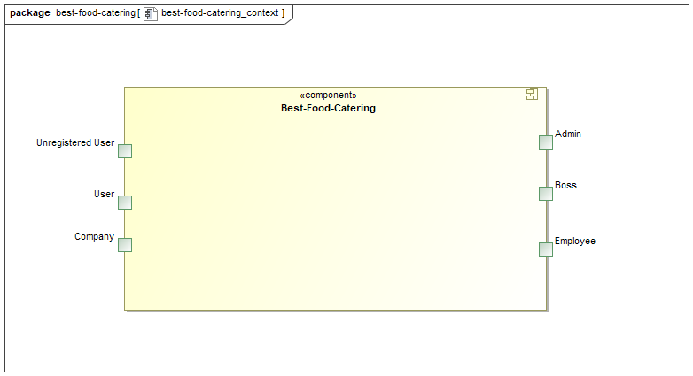

=== 5.2 Top-level architecture
Top-Level view of our system.

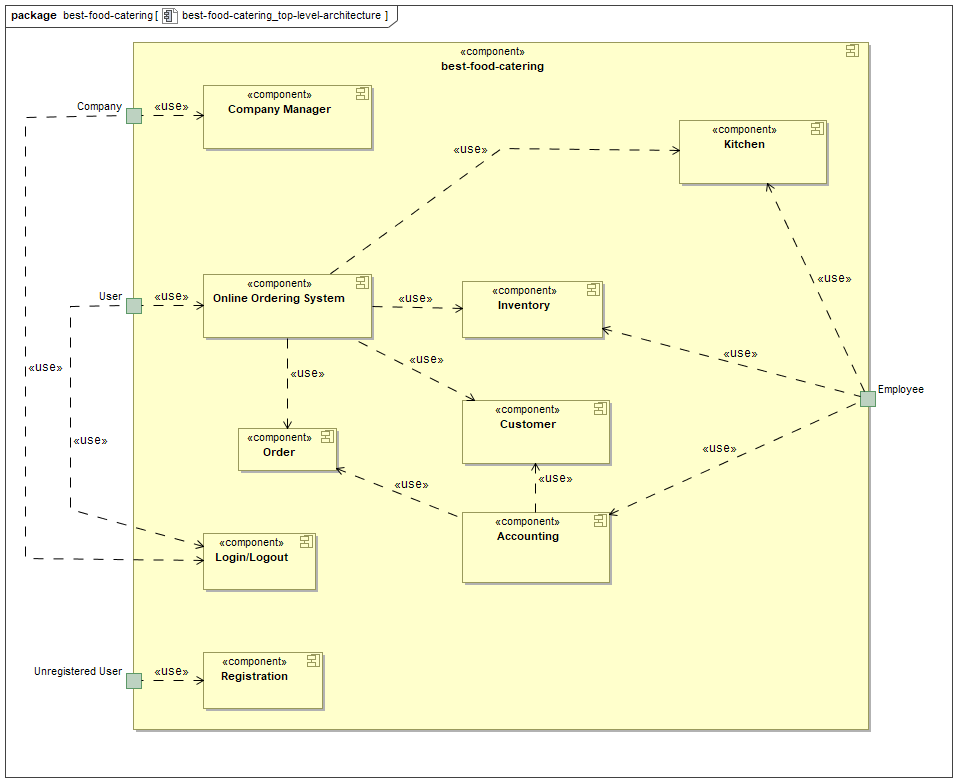

== 6. Use-Cases

This section will give an overview of the use cases the system has to support. These use cases describe what functionality the system has to provide (mostly) from the client’s point of view and which actors are involved.

=== 6.1 Actors

Actors are users of the system or neighbouring systems who/which access it. The following table summarizes all actors of the system and provides a description of the actor. Abstract actors (i.e. an actor which groups other actors, written in italic) are used to generalize and group.

// See http://asciidoctor.org/docs/user-manual/#tables
[options="header"]
[cols="1,4"]
|===
|Name |Description
|best_food_catering.user  | Representative for every customer who does have an account with us. Before they’re allowed to interact with the Online Ordering System, the Company entity they belong to has to unlock them.
|Company | A company can interact with the Company Management component, allowing them to accept or remove any of their employees.
|Best-Food-Catering Employee | Representative for every employee of Best-Food-Catering with an employee account. Is allowed to update their personal details.
|Accountant | An accountant is a Best-Food-Catering Employee who can interact with the Accounting component. This includes viewing all orders, managing customer data and locking company accounts.
|Kitchen Staff | The Kitchen staff is a Best-Food-Catering Employee who can interact with the Kitchen component. This includes creating the weekly menu, changing recipes and adding or deleting dishes.
|Storekeeper | A storekeeper is a Best-Food-Catering Employee who can interact with the Inventory component. They can check the current inventory and reorder items that the Kitchen used.
|Admin | The admin is a Best-Food-Catering Employee who is tasked with managing employee accounts.
|Best-Food-Catering Boss | The Boss can interact with every single internal component.
|===

=== 6.2 Use-Case Diagram

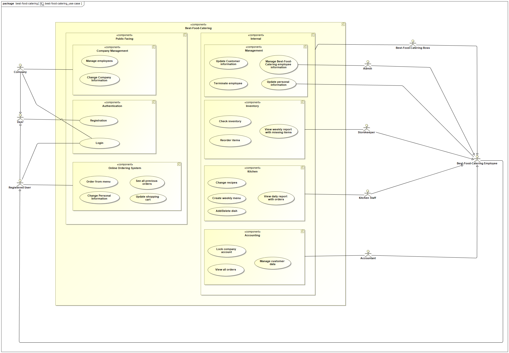

=== 6.3. Use-Case Descriptions
image::models/analysis/best-food-catering_squence-diagram%20-%20Activation%20of%20a%20user%20account%20that%20belongs%20to%20a%20company.png[Sequence-Diagram 1]

[cols="1h, 3"]
[[UC001]]
|===
|ID                         |UC001
|Name                       |Customer Registration & Activation
|Description                |An employee of a Kindergarten or Company shall be able to create an account. Their company can then unlock their account.
|Actors                     |Unregistered best_food_catering.user & Company
|Trigger                    |Unregistered best_food_catering.user wants to create an account for themself by pressing "Registrieren" on our site.
|Precondition(s)            |Actor is not logged in yet.
|Essential Steps           a|
_Registration_:

  1. Unregistered best_food_catering.user is on our Registration site.
  2. Unregistered best_food_catering.user enters their name and a secure password.
  3. Unregistered best_food_catering.user selects a company that they belong to.
  4. Unregistered best_food_catering.user clicks “Bestätigen”.

_Activation_:

  1. Company is on Company Management site.
  2. Company confirms that Unregistered best_food_catering.user is indeed an employee of theirs.
  3. Company clicks “Bestätigen”.

|Extensions                 |-
|Functional Requirements    |-
|===

image::models/analysis/best-food-catering_squence-diagram%20-%20Order%20via%20Kita%20-%20group%20billing%20%26%20debit%20(Lastschrift).png[Sequence-Diagram 2]

[cols="1h, 3"]
[[UC002]]
|===
|ID                         |UC002
|Name                       |best_food_catering.user (Parent) orders a meal for their children in a Kita/Kindergarten
|Description                |A best_food_catering.user, in this case a parent, shall be able to order a meal, in this case for their child. The parent selected the group billing method and the Kita (a Company Actor) has previously selected “Lastschrift” as their payment method.
|Actors                     |best_food_catering.user & Company
|Trigger                    |best_food_catering.user views the weekly menu and selects meal(s) to order.
|Precondition(s)            |Company has selected “Lastschrift” as payment method.

Company has confirmed best_food_catering.user as an employee (or parent in this case) of theirs.

|Essential Steps           a|
_User_:

  1. best_food_catering.user is on our menu site.
  2. best_food_catering.user selects a meal or multiple meals to order.
  3. best_food_catering.user selects “Gruppenabrechnung”.
  4. best_food_catering.user confirms order by clicking “Bestätigen”.

|Extensions                 |-
|Functional Requirements    |-
|===

image::models/analysis/best-food-catering_squence-diagram%20-%20Cook%20creates%20meal%20to%20add%20that%20to%20next%20week's%20menu.png[Sequence-Diagram 3]

[cols="1h, 3"]
[[UC003]]
|===
|ID                         |UC003
|Name                       |Kitchen Staff creates new Meal to add it to next week’s menu
|Description                |A Kitchen Staff actor creates a new menu and next week’s menu.
|Actors                     |Kitchen Staff
|Trigger                    |A Kitchen Staff actor is logged in to the Kitchen and clicks “Neues Gericht hinzufügen”.
|Precondition(s)            |Kitchen Staff actor is logged in.
|Essential Steps           a|
_Kitchen Staff_:

  1. Kitchen Staff is on Kitchen site.
  2. Kitchen Staff creates new meal and specifies recipe.
  3. Kitchen Staff confirms.
  4. Kitchen Staff creates new menu and specifies meals, which includes the newly created meal.
  5. Kitchen Staff confirms.

|Extensions                 |-
|Functional Requirements    |-
|===

== 7. Functional Requirements

[options="header"]
|===
|ID |Version |Name |Description
|01 | v0.1 | Registration | The system will provide a non-registered user the ability to register himself into the system by providing the following information: A unique username, a password, payment details and if they're a company or single customer. After a successful validation of the data the user will gain access to the system.
|02 | v0.1 | Login | The user will provide their password and username and then according to their role will be able to access different parts of the system.
|03 | v0.1 | Inventory | The system will be able to store data about how many ingredients there are in the inventory.
|04 | v0.1 | Order more Ingredients | The system will be able to order more Ingredients and add them to our inventory.
|05 | v0.1 | Order Meal | A school, kindergarten or business will be able to see an overview of the meals of the week with their corresponding prices and portion sizes.
|06 | v0.1 | Weekly Billing | Once a week our system the bill the the corresponding user, either as a group or as a individual.
|07 | v0.1 | Alter Menu | A kitchen employee will be able to make changes to the menu.
|08 | v0.1 | Lock Account | The accounting team has the ability to lock a user’s account if they do not pay.
|09 | v0.1 | Manage System | The boss can alter any function of the whole system.
|10 | v0.1 | Accept best_food_catering.user | The boss will be able to accept new users entering the system.
|11 | v0.1 | Manage Inventory | The system will be able to manage the inventory. This includes sending Email to the storekeeper with missing ingredients.
|===

== 8. Non-Functional Requirements

=== 8.1. Quality Demands

Our quality model is based on ISO/IEC 9126, with 1 being "not important" and 5 being "very important".

[options="header"]
|===
|Quality Goal |1 |2 |3 |4 |5
|Functionality | | | | |x
|Reliability | | |x | |
|Usability | | | |x |
|Efficiency |x | | | |
|Maintainability | | |x | |
|Portability |x | | | |
|Extendability | | | | |x
|===

=== 8.2. Concrete Non-Functional Requirements

[options="header"]
|===
|ID |Version |Name |Description
|[NF001] | v0.1 | Security - Password storage | Passwords are stored as hashes
|[NF002] | v0.1 | Open Source | Our Code is free for everyone
|[NF003] | v0.1 | Gender-neutral language | The language is supposed to address any person
|===

== 9. GUI Prototype

It should be noted that unfortunately on some prototypes the “settings” are missing in the navigation bar. Nevertheless, you can easily imagine how it looks with this option, because on some it is visible. From Order Meals to Cart those are the views of a regular user. Due to a lack of time, those are not all views yet.

**Login**

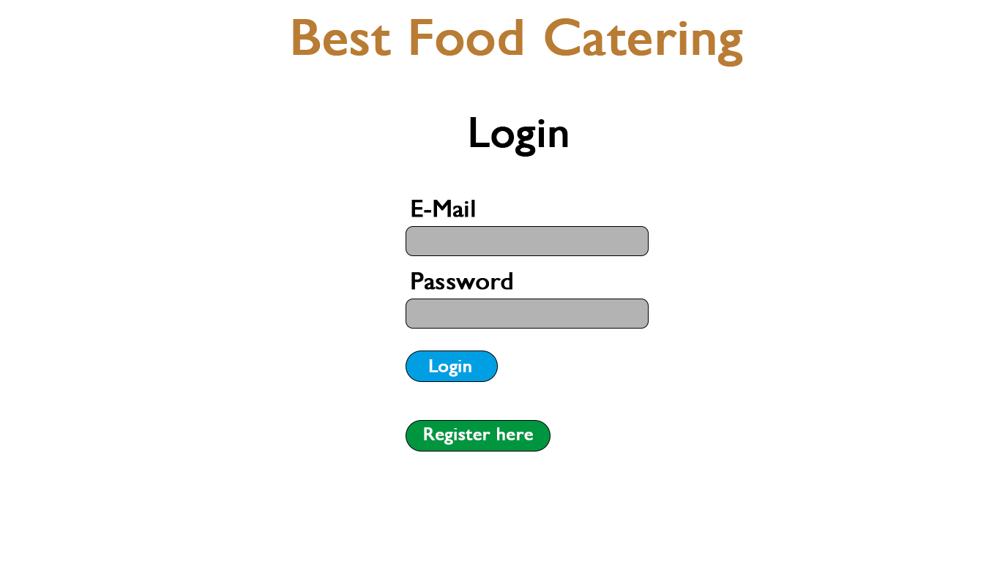

**Registration**

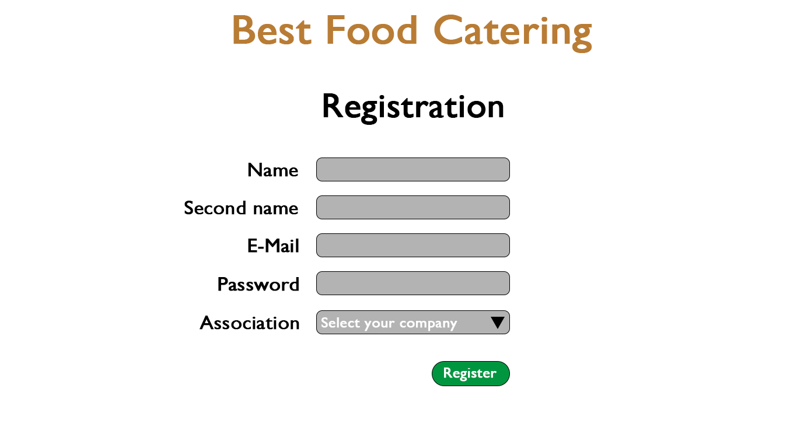

**Welcome/Menu**

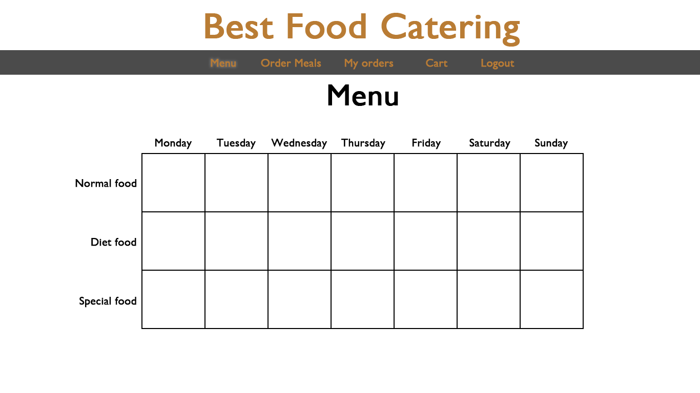

**Order Meals**

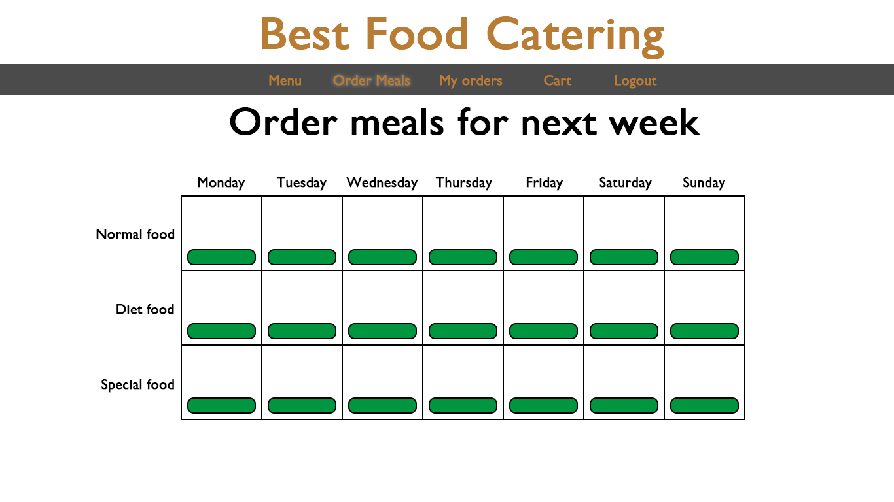

**My Orders**

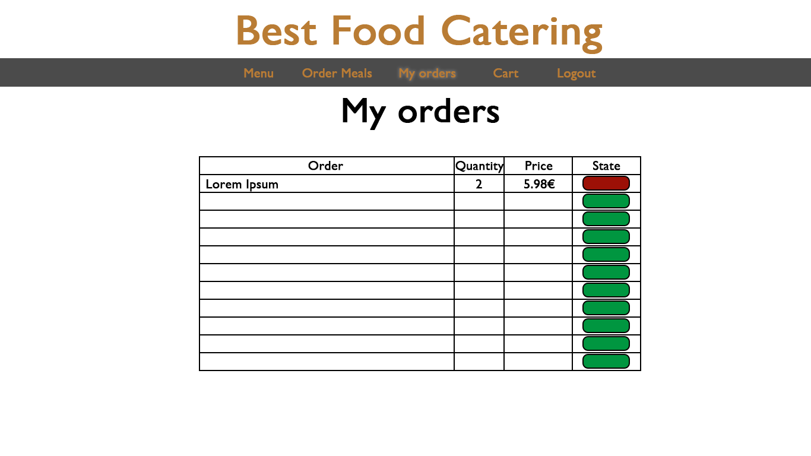

**Cart**

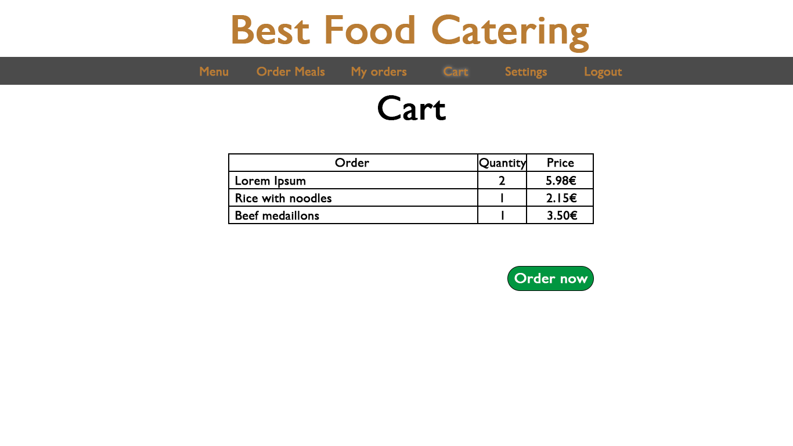

**Settings**

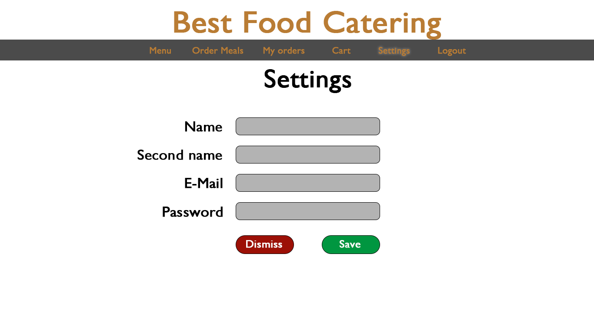

**Manage Employees**

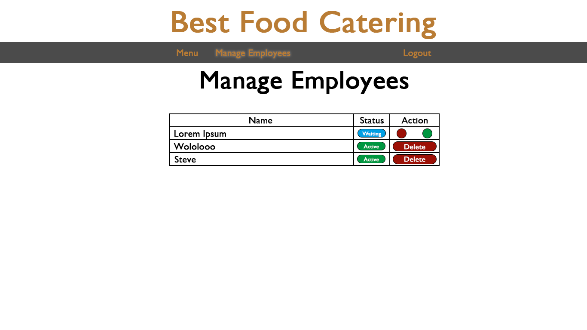

== 10. Data Model

=== 10.1. Class Diagram

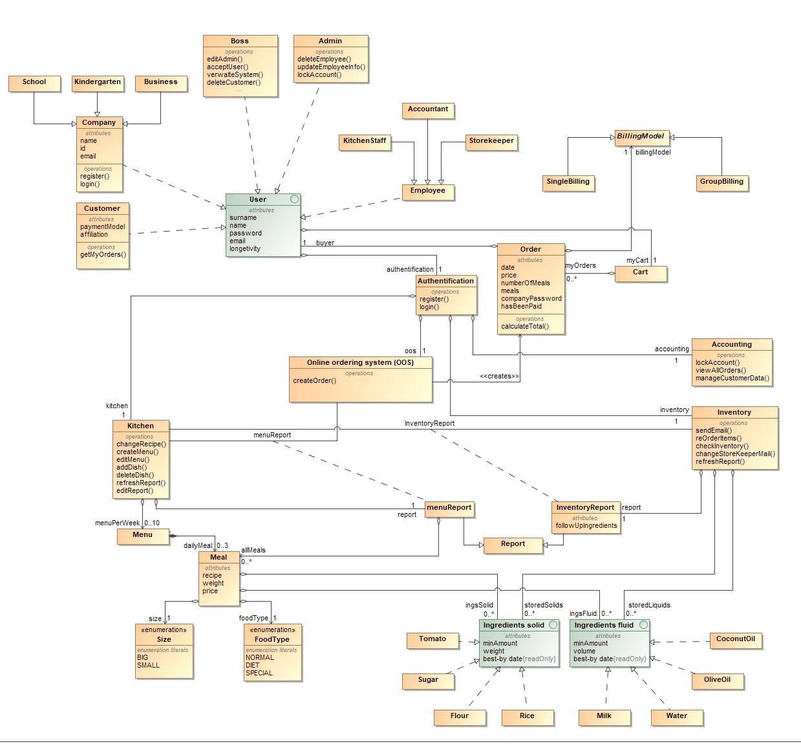

=== 10.2. Classes and Enumerations

[options="header"]
|===
|Class/Enumeration |Description
|best_food_catering.user | A class representative for every person or company who has an account.
|Company | an aggregate of customers
|Customer | one particular client
|School/Kindergarten/Business | a type of company using the services of the Best-Food-Catering company
|Boss | the CEO of Best-Food-Catering can make any changes to the whole system
|Admin | responsible for technical tasks
|Employee | someone who works for the Best-Food-Catering company
|Profession | the particular task of the employee
|Online Ordering System | the interface for the customers to interact with the Best-Food-Catering company
|Authentication | the authentication of a user
|Order | the order of a user
|Cart | where the products to be ordered are stored before they are ordered
|BillingModel | the way the user want to pay, either in a group or as an individual
|SingleBilling | the customer pays by themselves
|GroupBilling | a kindergarten or school pays for several customers
|Accounting | storing and managing user information and orders
|Inventory | the storage for ingredients needed in the kitchen
|Kitchen | the place where the (best) food is made
|Menu | todays menu consisting of three possible meals
|Meal | a tasty meal
|Size | the size of the meal (big or small)
|FoodType | the category a meal belongs to
|Report | information to be passed between different compartments of the company
|MenuReport | the report to inform the kitchen about the required meals
|InventoryReport | a report from the kitchen to the inventory to get the ingredients needed for the meals
|Ingredients solid | a base ingredient for a meal in solid form that can be measured in kg
|Ingredients fluid | a base ingredient for a meal in liquid form and are measured in liters
|Tomato/Sugar/Flour/Rice | examples of solid Ingredients
|Milk/Water/OliveOil/CoconutOil | examples of liquid ingredients
|===

== 11. Acceptance Testing
[options="header"]
|===
|ID |Action |Result
|01 | person registers with valid data and is accepted by boss | data of the person is stored in the database
|02 | person tries to register with missing/invalid data | the person is told to register again and is not saved in the database
|03 | person logs in with correct username-password combination | person is now logged in and can access further services
|04 | person tries to log in with incorrect username-password combination |  person is told to register again
|05 | ingredient past its sell-by date | ingredient gets deleted from inventory
|06 | number of ingredient falls below threshold | storekeeper is informed via email
|07 | customer gets deleted by admin |  customer is removed from database
|08 | customer orders with correct input and confirms their order | new order is created containing all necessary information, order is stored in database, customer can view their orders
|09 | customer orders with incorrect input | customer is told to order again using correct input
|10 | customer changes personal information  | personal information of customer changed in database
|11 | customer belongs to kindergarten/ school and selects group billing  | customer is not told to pay but their kindergarten/ school will pay for him
|12 | customer selects single billing  | customer goes through the paying process
|13 | customer does not pay/does not have enough money  | customer can’t order anymore until they pay, account is locked
|14 | customer wants to see their ongoing orders  |orders are shown to him in the cart
|15 | employee gets deleted by admin  | (former) employee is no longer able to change stuff in their former workplace and gets removed from database
|16 | time is 00:01 on a Monday | report is sent from Online Ordering System to kitchen containing meals to be cooked and their recipes
|17 | storekeeper gets informed about scarcity of ingredient | storekeeper reorders ingredient
|18 | storekeeper reorders ingredients  | ingredients are added to inventory
|19 | kitchen staff changes report | report is changed in corresponding view
|20 | users longevity date expired | user is deleted from database
|21 | customer choses direct debit as a payment option  | the customer gets charged immediately
|22 | customer chooses bank transfer as a payment method | customer has to check or type in his bank transfer data
|===

== 12. Glossary
[options="header"]
|===
|Term |Description
|Company | See Classes and Enumerations
|Boss | See Classes and Enumerations
|best_food_catering.user | See Classes and Enumerations
|Admin | See Classes and Enumerations
|Parent | best_food_catering.user that belongs to a Kita/Kindergarten
|OOS | See Classes and Enumerations
|Cart | See Classes and Enumerations
|Order | See Classes and Enumerations
|Employee | See Classes and Enumerations
|Billing Model | See Classes and Enumerations
|Single Billing | See Classes and Enumerations
|Group Billing | See Classes and Enumerations
|Direct Debit (Lastschrift) | Payment with debit card
|Bank Transfer | Payment with a bank transfer
|Solid Ingredients | See Classes and Enumerations
|Liquid Ingredients | See Classes and Enumerations
|Inventory | See Classes and Enumerations
|Profession | See Classes and Enumerations
|Meal | See Classes and Enumerations
|FoodType | See Classes and Enumerations
|Menu | See Classes and Enumerations
|Kitchen | See Classes and Enumerations
|Size | See Classes and Enumerations
|Authentication | See Classes and Enumerations
|Kindergarten | See Classes and Enumerations
|===
